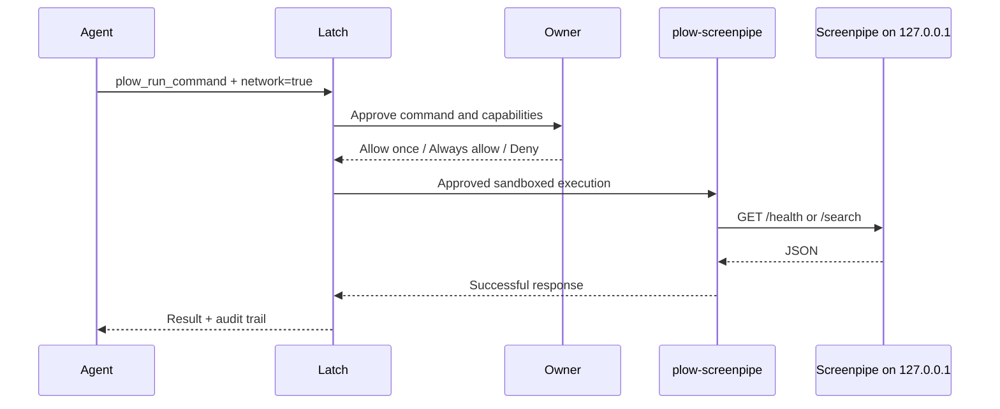

# Screenpipe history for Latch

Adds `plow-screenpipe`, an adapter to [Screenpipe](https://github.com/screenpipe/screenpipe) with read-only
history queries and an opt-in CLI installer. Agents can install the engine and search screen text and audio
transcripts through `plow_run_command`. The Plugins tab lists **Screenpipe history**; turning it off
withdraws its skill and refuses its commands.

## Setup

1. Stage this plugin with `just stage-plugins screenpipe`, then restart a from-source Latch. Packaged builds
   include it through the existing `vendor/plugins` resource entry.
2. Ask the agent to install Screenpipe on this Mac. The published [skill.md](skill.md) includes the exact
   `plow_run_command` call with `network=true` and `write_paths=["~/.screenpipe"]`. The owner approves both.
   It installs native CLI 0.4.52 from the official npm platform package, verifies its pinned SHA-512 digest,
   and keeps the engine, native resources and license under `~/.screenpipe/latch-cli/0.4.52-<uname -m>/`.
   Node, Homebrew and administrator access are unnecessary. Existing releases are reused. If the owner
   already runs the desktop app, use its API directly; a second recorder is unnecessary.
3. Start a foreground test in the owner's terminal:

   ```sh
   "$HOME/.screenpipe/latch-cli/0.4.52-$(uname -m)/bin/screenpipe" record --disable-telemetry
   ```

   Add `--disable-audio` for a screen-only test. Grant Screen Recording and Accessibility in macOS System
   Settings, and Microphone for audio. Ctrl+C stops the test. An installed CLI does not prove recording
   permissions or capture dependencies are ready. FFmpeg is required for audio; follow the CLI diagnostic
   if it is missing. Installation does not start a recorder, add a login service, or configure other agents.
4. If Screenpipe requires authentication, copy its existing key directly into the adapter's private file:

   ```sh
   mkdir -p "$HOME/.config/plow-latch"
   (umask 077; "$HOME/.screenpipe/latch-cli/0.4.52-$(uname -m)/bin/screenpipe" auth token > "$HOME/.config/plow-latch/screenpipe-api-key" 2>/dev/null)
   chmod 600 "$HOME/.config/plow-latch/screenpipe-api-key"
   ```

   This copies the key without printing it. Keep it out of chat, manifests, tool arguments, and logs.
   Repeat after rotating the Screenpipe key. An empty or malformed file fails closed. Without a key file,
   the adapter supports instances with API authentication disabled; an authenticated instance returns a
   fixed setup hint. `/health` does not require a key. An owner-authorized local agent can perform the copy
   using shell redirection and an explicit write grant; the token must never return as tool output.
   For an existing desktop installation, use its supported CLI rather than a different profile's key.
5. Run the health and search examples in [skill.md](skill.md). Every API call requires `network=true`.

For a from-source terminal install, run this from the repository root:

```sh
SCREENPIPE_INSTALL_DIR="$HOME/.screenpipe/latch-cli" /bin/sh apps/desktop/plugins/screenpipe/install.sh
```

This runs the same installer as the agent-facing command. The [official installation guide](https://docs.screenpipe.com/getting-started)
documents the CLI distribution. The npm package metadata pins [Apple Silicon](https://registry.npmjs.org/@screenpipe/cli-darwin-arm64/0.4.52)
and [Intel](https://registry.npmjs.org/@screenpipe/cli-darwin-x64/0.4.52) tarballs and their integrity values.

The default port is 3030. For a different local port, change the manifest's fixed `SCREENPIPE_API_PORT`
before staging. Callers cannot supply a host, port, URL, key file, or curl configuration through argv.
The manifest's `SCREENPIPE_API_KEY_FILE` resolves against the owner's home, independently of `DOMO_HOME`.
Latch's **Ready** status means the adapter is available. It does not probe Screenpipe or verify recording;
the skill explicitly requires `health` before a search.

## Commands and boundaries

| Command | API | Behavior |
| --- | --- | --- |
| `plow-screenpipe --help` | None | Local usage; no network or key access |
| `plow-screenpipe health` | `GET /health` | Recorder status and capture timestamps; no key access |
| `plow-screenpipe search [options]` | `GET /search` | JSON results and pagination; requests `max_content_length=2000` |
| `plow-screenpipe install` | Official npm registry | Owner-approved write; installs a verified, pinned native CLI without starting capture |

Search accepts `--query`, `--content-type`, `--app-name`, `--window-name`, `--start-time`, `--end-time`,
`--limit`, `--offset`, and `--order`. It defaults to 20 results, newest first. Limits are 1..100; offsets
are 0..1000000. Text and timestamp values use curl's `--data-urlencode`; even `@file` and `&token=...` are
query text rather than file reads or extra parameters. Unknown flags and subcommands fail before HTTP.
Date parsing stays with Screenpipe; use RFC3339 with an explicit timezone. The wrapper translates
`--order asc|desc` to Screenpipe's API values `ascending|descending`.
Current Screenpipe keeps the first and last halves of long text, plus a truncation marker; the marker adds
characters beyond 2000. Older API versions may ignore this option. The adapter also bounds the response file.



The adapter uses macOS `/bin/sh` and `/usr/bin/curl`, so both Mac architectures use the same source files.
Queries download nothing. The optional installer downloads only the pinned native npm platform package
after approval, keeps it outside Latch, verifies SHA-512 before extraction, and publishes the release
atomically. It preserves incomplete existing releases for repair and serializes concurrent installations.
It adds no postinstall hooks, daemon, npm dependency, Screenpipe source, or binaries to Latch's distribution.
The existing staging script copies the plugin, and the existing manifest parser and dispatcher load it.

The network capability grants network generally in Latch's current sandbox. The adapter itself fixes the
host to `127.0.0.1`, ignores `.curlrc`, disables proxies, and refuses redirects. It sends the bearer header
through curl's stdin, keeping the key out of process argv and Latch's audit records. Error bodies are
discarded; errors use fixed messages. Responses use a disposable file in the executor's scratch directory,
with a file-size limit and a 15-second request deadline; the file is removed on exit.

The manifest classifies `install` as a write; history commands keep their existing read-prefix rules.
The wrapper has no route for recording controls, raw SQL, media export, notifications, pipes, or computer
control. Searches explicitly disable embedded frames and cloud
retrieval. Successful results travel to the requesting agent through Latch, so enabling a local adapter
does not keep the retrieved history on-device. The skill limits retrieval to the owner's task and treats
captured content as untrusted input. An Always allow rule for `search` covers future query/filter values
with the same capabilities, following Latch's existing read-prefix rule behavior.

## Research and design decision

Investigated upstream commit [`798ac08`](https://github.com/screenpipe/screenpipe/tree/798ac0866fc671971845e810782b23b77683fafb)
on 2026-10-03. Source links below pin that revision because upstream main moves frequently.

| Area | Findings and consequence for this plugin | Source |
| --- | --- | --- |
| Capture | Rust capture reacts to app switches, clicks, scrolling, typing pauses, and idle timers. It pairs screen captures with accessibility text and uses OCR as fallback. Audio has its own transcription pipeline. Screenpipe owns these permissions and processes. | [Architecture](https://github.com/screenpipe/screenpipe/blob/798ac0866fc671971845e810782b23b77683fafb/docs/mintlify/docs-mintlify-mig-tmp/architecture.mdx) |
| Storage | History uses SQLite and media files under Screenpipe's data directory. Its daemon owns queries and database lifecycle. This adapter uses HTTP rather than opening a live database or WAL. | [Database architecture tests](https://github.com/screenpipe/screenpipe/blob/798ac0866fc671971845e810782b23b77683fafb/crates/screenpipe-db/tests/sqlite_architecture_invariants_test.rs) |
| Search | `/search` accepts text, content type, app/window, timestamps, ordering and pagination. `include_frames` and `include_cloud` default false; we also send false explicitly. `parsed` records are experimental. | [SearchQuery and handler](https://github.com/screenpipe/screenpipe/blob/798ac0866fc671971845e810782b23b77683fafb/crates/screenpipe-engine/src/routes/search.rs) |
| Health | `/health` reports frame/audio states and freshness. Healthy transport alone does not prove ongoing capture. | [Health route](https://github.com/screenpipe/screenpipe/blob/798ac0866fc671971845e810782b23b77683fafb/crates/screenpipe-engine/src/routes/health.rs) |
| Authentication | When enabled, auth applies even on localhost. `/health` is exempt. `screenpipe auth token` resolves the existing key from environment, encrypted storage, or legacy/recovery files without minting one. We let the owner export it through that supported CLI. | [Middleware](https://github.com/screenpipe/screenpipe/blob/798ac0866fc671971845e810782b23b77683fafb/crates/screenpipe-engine/src/server.rs), [resolver](https://github.com/screenpipe/screenpipe/blob/798ac0866fc671971845e810782b23b77683fafb/crates/screenpipe-engine/src/auth_key.rs), [auth command](https://github.com/screenpipe/screenpipe/blob/798ac0866fc671971845e810782b23b77683fafb/crates/screenpipe-engine/src/cli/auth.rs) |
| MCP | `screenpipe-mcp` is an HTTP API client with stdio and HTTP transports. Its full tool set includes writes and computer control; HTTP exposes fewer tools. Latch currently integrates CLI plugins rather than chaining MCP servers, so a dedicated read-only adapter fits its approval path. | [MCP implementation](https://github.com/screenpipe/screenpipe/blob/798ac0866fc671971845e810782b23b77683fafb/packages/screenpipe-mcp/src/index.ts), [HTTP transport](https://github.com/screenpipe/screenpipe/blob/798ac0866fc671971845e810782b23b77683fafb/packages/screenpipe-mcp/src/http-server.ts) |
| Distribution | Current upstream uses the Screenpipe Commercial License. This PR contains an independently written API adapter and does not redistribute upstream code or executables. Screenpipe installation and its applicable license remain separate. | [Upstream license](https://github.com/screenpipe/screenpipe/blob/798ac0866fc671971845e810782b23b77683fafb/LICENSE.md) |

Alternatives considered: bundling the recorder would add capture permissions, installation lifecycle and
distribution obligations; invoking `npx screenpipe-mcp` would add a runtime dependency, first-run downloads
and an MCP client bridge; direct SQLite queries would couple the plugin to storage and encryption details.
The HTTP adapter uses the existing Latch plugin contract and a small command allowlist.

## Verification

```sh
npx tsc -b
npx vitest run packages/device-core/test/screenpipePlugin.test.ts packages/device-core/test/pluginSkills.test.ts packages/mcp-server/test/screenpipe.test.ts apps/desktop/test/pluginsModel.test.ts apps/desktop/test/onboardingExamples.test.ts
node scripts/stage-plugins.mjs screenpipe
node scripts/screenpipe-smoke.mjs
```

The CLI tests run the actual shell parser against an executable curl fixture, with no listening server.
Installer tests use synthetic tarballs with real SHA-512 verification and extraction: both architectures,
offline reuse, corrupt downloads, unsupported systems, failed downloads, cleanup and preservation of
existing releases. Actual native execution and capture must be checked separately on a real Mac.
The MCP tests use the real manifest, skill registry, capability construction, policy engine and audit log.
The help execution also runs through macOS seatbelt. HTTP evidence should identify whether its backend is
a synthetic API fixture or a real Screenpipe installation; UI evidence should identify whether it comes
from a browser renderer fixture or the Electron app. Neither fixture proves real capture or transcription.
The manual smoke script runs nine cases against a synthetic HTTP API using system curl through the real
MCP approval and sandbox path, and saves its report, audit events and approval view model under `work/`.
